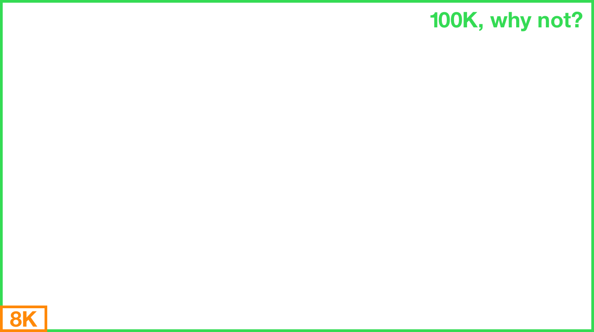
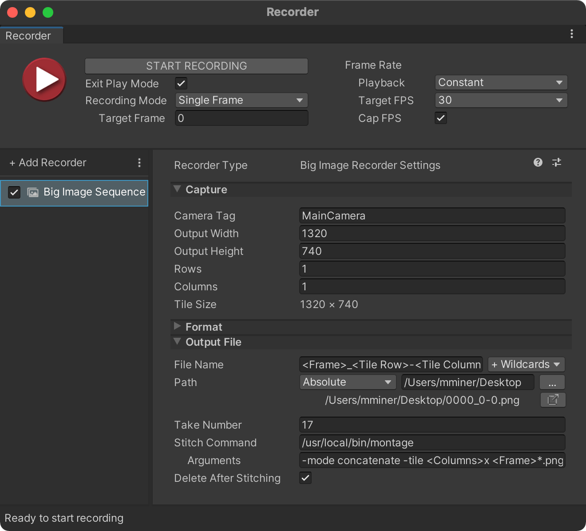
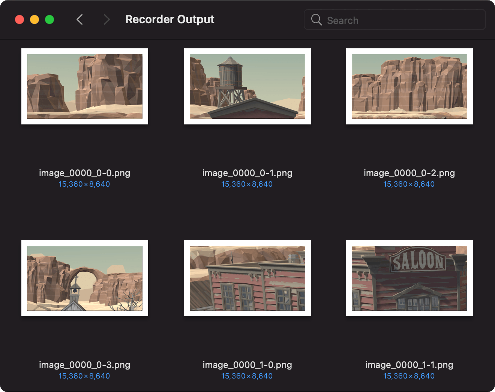
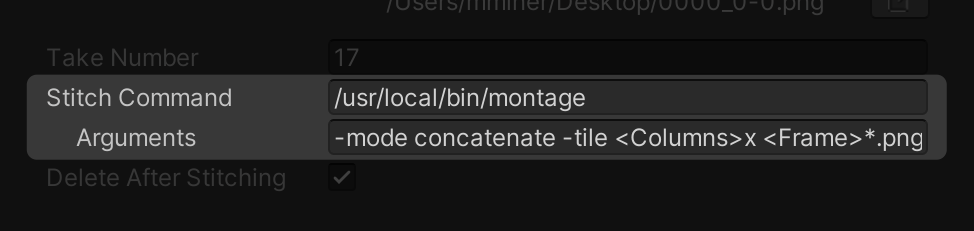
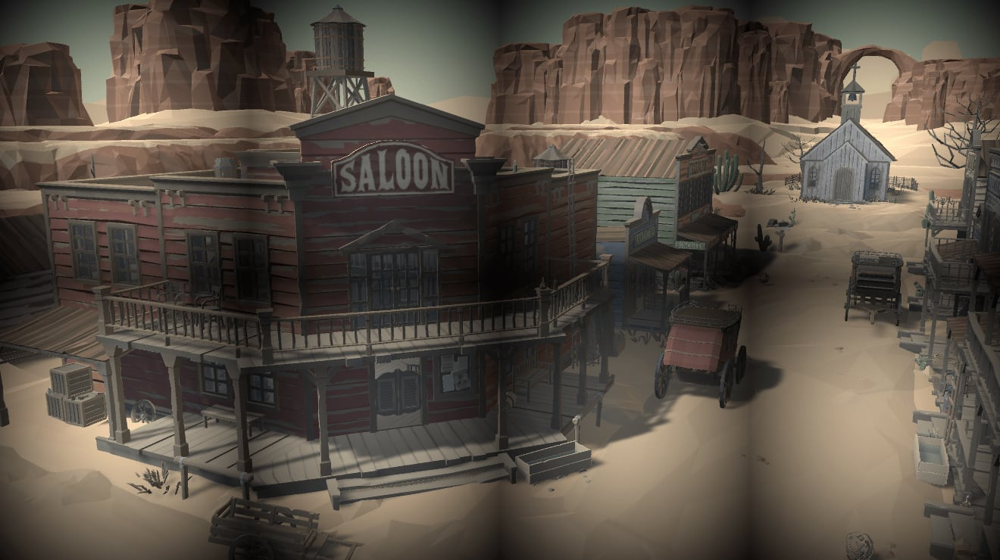

# Big Image Recorder

This [Unity Recorder](https://docs.unity3d.com/Manual/com.unity.recorder.html)
plugin allows you to capture an image sequence at a higher resolution than the
maximum texture size. Want to output your scene at 100,000 x 100,000 pixels? You
got it friend.

It accomplishes this by dividing the camera's projection matrix into tiles and
saving the renders as individual images to stitch together. At present this
stitching operation is left up to you (but see "Image Stitching" below for
recommendations).

## Installing

Add this package to your project using the Unity Package Manager (UPM).

1. Open *Window > Package Manager*
2. If it's not already in your project, install Recorder from the Unity Registry
3. Click "+" in the top-left corner and choose "Add package from git URL..."
4. Enter https://github.com/mminer/big-image-recorder.git

You can also clone this repository and point UPM to your local copy. Do this if
you want to modify the source code.

## Using

1. Open *Window > General > Recorder > Recorder Window*
2. Click "Add Recorder" and choose "Big Image Sequence"
3. Enter the tag of your target camera (or keep the default to use your main camera)
4. Enter your desired output size, number of rows and columns, and start recording

Recorder spits out multiple images per frame, one for each "tile". By default
these are named `image_<Frame>_<Tile Row>-<Tile Column>.png`, e.g.
*image_0003_1-1.png*.

### Image Stitching

[ImageMagick](https://imagemagick.org) is one option to stitch the image tiles
together into a final image.

    # Stitches together a frame of two columns.
    montage -mode concatenate -tile 2x *.png out.png

To run this automatically, enter the absolute path to the executable in the
"Stitch Command" field and its arguments (i.e. `-mode ...`) in "Arguments". For
example, if you install ImageMagick on macOS using Homebrew, enter
`/usr/local/bin/montage` as the command.

The arguments can contain the same wildcards as the file name. Use these to
specify the frame, rows, and columns, e.g. `-mode concatenate -tile
<Columns>x image_<Frame>*.png <Frame>.png`.

## Caveats

Stitching together individual tiles works poorly with some post-processing
effects. Vignette, for example, gets applied after the camera renders, and when
you stitch the tile images together it leaves noticeable seams where the edges
meet.

For best results, turn off all screen space effects.
